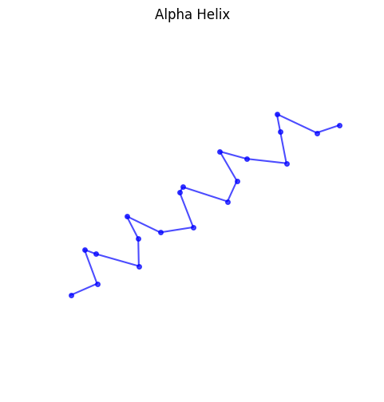
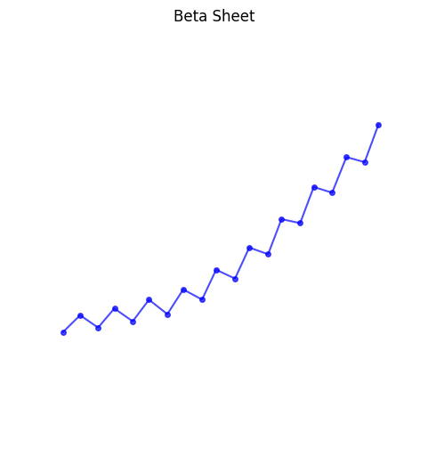
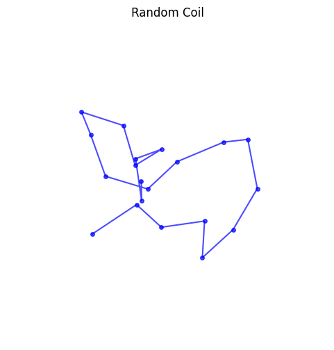
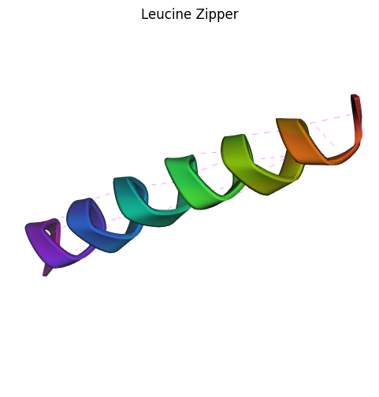
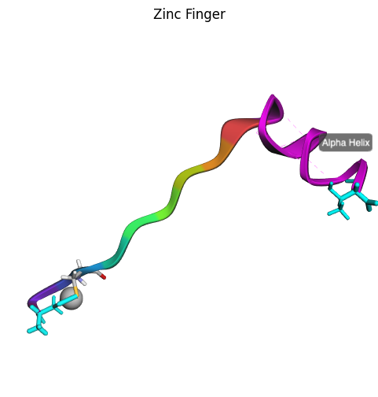
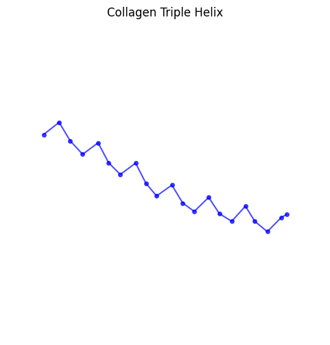
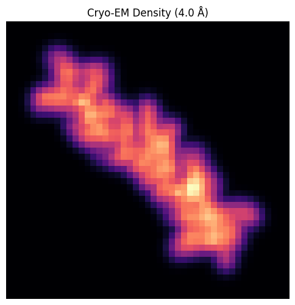
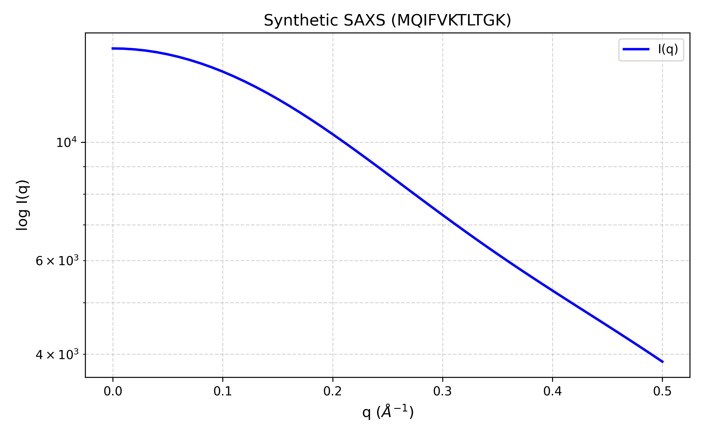

# Examples Gallery

Browse inspiring examples and copy-paste commands to get started quickly.

## Basic Structures

### Alpha Helix

The most common secondary structure in proteins.



```bash
synth-pdb --length 20 --conformation alpha --visualize
```

**Features**:
- 3.6 residues per turn
- 5.4 Å pitch
- Hydrogen bonds between i and i+4 residues

---

### Beta Sheet

Extended conformation with characteristic pleated structure.



```bash
synth-pdb --length 20 --conformation beta --visualize
```

**Features**:
- Extended backbone (phi ≈ -120°, psi ≈ +120°)
- 3.3 Å between residues
- Parallel or antiparallel arrangements

---

### Random Coil

Disordered structure with diverse conformations.



```bash
synth-pdb --length 20 --conformation random --visualize
```

**Features**:
- Ramachandran angles sampled from allowed regions
- No regular secondary structure
- Useful for testing flexibility

---

## Biologically-Inspired Structures

### Leucine Zipper

Classic coiled-coil motif with hydrophobic interface.



```bash
synth-pdb --sequence "LKELEKELEKELEKELEKELEKEL" \
    --conformation alpha \
    --minimize \
    --visualize
```

**Scientific Context**:
- Heptad repeat pattern (a-b-c-d-e-f-g)
- Leucines at 'a' and 'd' positions form hydrophobic core
- Found in transcription factors (e.g., GCN4, c-Fos, c-Jun)

---

### Zinc Finger

DNA-binding motif coordinating Zn²⁺ ion.



```bash
synth-pdb --sequence "CPHCGKSFSQKSDLVKHQRT" \
    --structure "1-10:beta,11-20:alpha" \
    --metal-ions auto \
    --minimize \
    --visualize
```

**Scientific Context**:
- Cys₂His₂ coordination of Zn²⁺
- Beta-hairpin + alpha-helix architecture
- Found in transcription factors (e.g., TFIIIA, Sp1)

---

### Collagen Triple Helix

Unique left-handed helix with Gly-X-Y repeats.



```bash
synth-pdb --sequence "GPPGPPGPPGPPGPPGPPGPP" \
    --conformation polyproline \
    --minimize \
    --visualize
```

**Scientific Context**:
- Gly-Pro-Pro repeat pattern
- Left-handed helix (opposite of alpha helix)
- Three chains intertwine to form triple helix

---

### Silk Fibroin

Beta-sheet-rich structure with Ala-Gly repeats.

```bash
synth-pdb --sequence "AGAGAGAGAGAGAGAGAGAG" \
    --conformation beta \
    --minimize \
    --visualize
```

**Scientific Context**:
- Alanine-glycine repeats
- Antiparallel beta sheets
- High tensile strength

---

## Advanced Features

### Cyclic Peptide

Head-to-tail cyclized structure.

```bash
synth-pdb --sequence "GGGGGGGGGGGG" \
    --cyclic \
    --minimize \
    --visualize
```

**Applications**:
- Drug design (improved stability)
- Examples: Cyclosporine A, Oxytocin

---

### Disulfide Bonds

Covalent cross-links between cysteine residues.

```bash
synth-pdb --sequence "CGGGGGGGGGGC" \
    --conformation alpha \
    --minimize \
    --visualize
```

**Features**:
- Automatic detection of Cys pairs within 2.0-2.2 Å
- Stabilizes protein structure
- Common in extracellular proteins

---

### Mixed Secondary Structures

Helix-turn-helix motif.

```bash
synth-pdb --sequence "ACDEFGHIKLMNPQRSTVWY" \
    --structure "1-7:alpha,8-13:random,14-20:alpha" \
    --minimize \
    --visualize
```

**Features**:
- Multiple secondary structure regions
- Realistic protein architecture
- Useful for testing fold recognition

---

### D-Amino Acids

Mirror-image amino acids for peptide design.

```bash
synth-pdb --sequence "ALA-dALA-GLY-dGLY-SER-dSER" \
    --conformation alpha \
    --minimize \
    --visualize
```

**Applications**:
- Protease resistance
- Drug design
- Retro-inverso peptides

---

## NMR Data Generation

### Chemical Shifts

Generate structure with predicted NMR chemical shifts.

```bash
synth-pdb --length 30 \
    --conformation alpha \
    --gen-shifts \
    --output nmr_structure.pdb
```

**Output**: NEF file with ¹H, ¹³C, ¹⁵N chemical shifts

---

### Relaxation Rates

Generate structure with NMR relaxation data.

```bash
synth-pdb --length 30 \
    --conformation alpha \
    --gen-relax \
    --output nmr_structure.pdb
```

**Output**: NEF file with R₁, R₂, NOE values

---

### NOE Restraints

Generate distance restraints for structure calculation.

```bash
synth-pdb --length 30 \
    --conformation alpha \
    --gen-nef \
    --output nmr_structure.pdb
```

**Output**: NEF file with NOE distance restraints

---

## Dataset Generation

### Bulk Generation

Generate 1,000 diverse structures for ML training.

```bash
synth-pdb --mode dataset \
    --num-samples 1000 \
    --min-length 10 \
    --max-length 50 \
    --output ./training_data
```

**Output Structure**:
```
training_data/
├── dataset_manifest.csv
├── train/ (800 structures)
└── test/ (200 structures)
```

---

### Hard Decoys

Generate challenging negative samples.

```bash
synth-pdb --mode decoys \
    --sequence ACDEFGHIKLMNPQRSTVWY \
    --drift 5.0 \
    --num-samples 100 \
    --output ./decoys
```

**Use Cases**:
- Training robust AI models
- Testing structure validation tools
- Benchmarking scoring functions

---

---

## Multimodal Observables

Simulate integrated data from multiple structural biology techniques. For a hands-on demonstration, see the [Cryo-EM & SAXS Lab](../../examples/interactive_tutorials/cryo_em_saxs_lab.ipynb).

### Cryo-EM Density Maps

Generate 3D density volumes at a specific resolution.



```bash
synth-pdb --mode cryo-em \
    --sequence "MEELQK" \
    --resolution 4.0 \
    --output synthetic_map.mrc
```

**Scientific Context**:
- Simulates electron density at different resolutions (3.0Å - 10Å).
- Essential for testing map-to-model fitting algorithms.
- Supports ensemble averaging for flexible proteins.

---

### SAXS Profiles

Simulate Small-Angle X-ray Scattering solution data.



```bash
synth-pdb --mode saxs \
    --sequence "NSDSECPLSHDGYCLHDGVCMYIEALDKY" \
    --q-max 0.4 \
    --output protein_saxs.dat
```

**Scientific Context**:
- Uses the Debye formula to compute $I(q)$ vs $q$.
- Probes the global shape and "compactness" of a protein.
- Includes solvent subtraction (hydration shell) effects.

---

### Docking Preparation

Convert PDB to PQR for electrostatic and docking software.

```bash
synth-pdb --mode docking \
    --sequence "ACDEFGHIK" \
    --output ready_for_docking.pqr
```

**Scientific Context**:
- Assigns partial charges and Van der Waals radii.
- Uses OpenMM and AMBER forcefields for parameterization.
- Standard input for APBS and many protein-ligand docking engines.

## Next Steps

- [Biologically-Inspired Examples](biological.md) - More detailed biological examples
- [Visualization Examples](visualization.md) - Advanced visualization techniques
- [Advanced Features](advanced.md) - Expert-level usage
- [User Guides](../guides/beginners.md) - Comprehensive guides for different users
